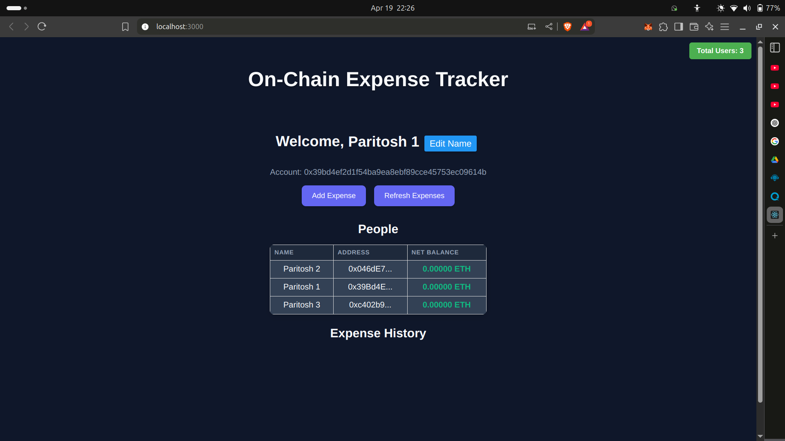

# 💸 Split Expense DApp - BlockBase

This is a mini decentralized app (DApp) project developed as part of a 7-day Blockchain Development Program conducted by an IIT Guwahati club. The original codebase was provided, and we were required to add a few additional features.

---

## 🛠️ Added Features

### 1. ✅ Show Total Active Users
- Created a `getTotalRegisteredUsers()` function in the Solidity smart contract.
- Added a `loadTotalUsers()` function in the JavaScript frontend to call this and display the total number of users.
- Integrated this within the `registerPerson` function using `await`.

### 2. ✏️ Edit User Name
- Added a `personUpdated` function in the Solidity contract to allow users to update their names.
- Implemented an `updateName()` function in JS to interact with the contract and handle the UI.
- Updated the frontend UI accordingly to support name editing.

---

## 🖼️ UI Preview

> *(Insert screenshot below if needed)*

---

## ✨ Credits

Developed during the **Blockchain Development Program by IIT Guwahati Club**.  
All base code was provided as part of the program.

---

## 🙋‍♂️ Author

**Paritosh**  
GitHub: [@SandstromPL](https://github.com/SandstromPL)
